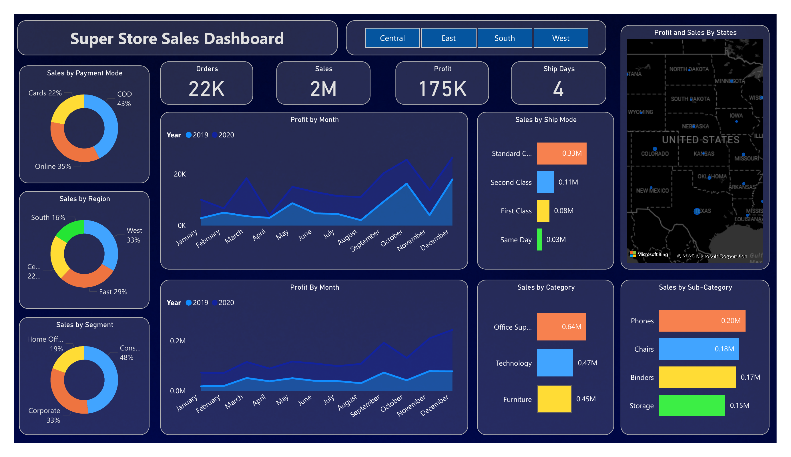

# Task_8_Sales_Dashboard

# Sales_Dashboard_Task_8

This project was created as part of my Data Analyst Internship (Task 8: Sales Dashboard) at Elevate Labs. It showcases interactive business intelligence dashboards created using Power BI to uncover insights from the Superstore Sales dataset.

---

## 📁 Dataset Used
- **Name**: Superstore Sales Dataset
- **Source**: Kaggle

---

## 🎯 Objective
To create meaningful data visualizations and deliver key business insights using Power BI by analyzing:
- Regional and category sales performance
- Discount impact on profits
- Order fulfillment by ship mode
- Customer segments and payment preferences
- Forecasted sales trends

---

## 📊 Dashboard Snapshots

### 📋 Performance Dashboard

---

## 🧠 Key Insights
- California and New York are top-performing states.
- Discounts beyond 20% significantly reduce profit margins.
- Standard class accounts for majority of shipping volume.
- Office Supplies is the highest-grossing category.
- December shows seasonal spikes in sales.

---

## 📄 Files Included
- `Super_Store_Sales_DashBoard - Akash Kumar Rajak.pbix` – Full Power BI dashboard
- `SuperStore_Sales_Dataset.csv` – Dataset used for the dashboard
- Dashboard images for presentation

---

## ✅ Outcome
Successfully practiced visual by choosing appropriate charts, eliminating clutter, and providing clear business context to support decisions.

---

## 📬 Contact
**Akash Kumar Rajak**    
Email: akashkumarrajak200@gmail.com  
